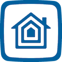
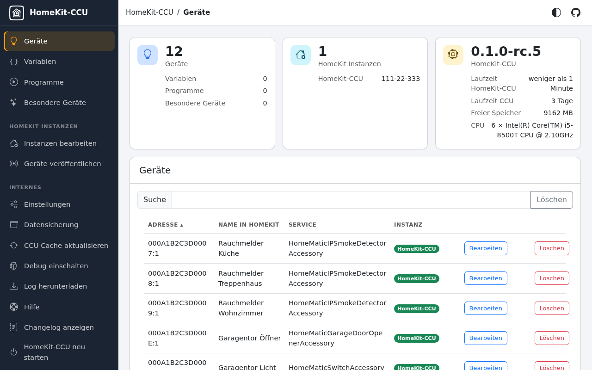

  

🇬🇧 English | <a href="README.de.md">🇩🇪 Deutsch</a>

<h1 align="center">HomeKit-CCU</h1>

  Your HomeMatic and HomematicIP devices in Apple Home. 
  Runs directly on your OpenCCU. No Homebridge, no extra hardware.

  
  
  
  

> [!IMPORTANT]
> **Requires OpenCCU 3.89 or newer** (it ships Node.js 22). CCU3 hardware works when it runs OpenCCU.
> Not supported: CCU2, CCU3 with the eQ-3 firmware, and older OpenCCU or RaspberryMatic releases. The installer stops with a clear message if Node.js is too old.

  

## What you get

- Your HomeMatic and HomematicIP devices in the Home app: control them there, use them in scenes and automations, and ask Siri.
- A setup assistant that takes over the rooms of your CCU, so every device lands in the right room.
- Choose your devices from a list with pictures, search and filters.
- Doorbells that Apple Home shows as doorbells: a ring notification with a picture and the chime on your HomePod. With a camera, the video doorbell adds live video and sound.
- History and extra values of your sensors in the Eve app.
- Configuration right in the CCU, protected by your CCU login.

## Supported devices

HomematicIP, HomeMatic and HomeMatic Wired devices appear as the accessory types Apple Home knows:

- **Climate:** radiator and wall thermostats, heating groups, temperature, humidity, CO₂ and particulate sensors, weather stations
- **Windows and doors:** contacts, window handles, roller shutters and venetian blinds with tilt, window drives, garage doors, door locks (DLD, DLP, KeyMatic)
- **Safety:** smoke, water and rain sensors, sirens, the CCU alarm as a security system
- **Lights and power:** dimmers, colour lights, switches, outlets, irrigation and water valves
- **Buttons and sensors:** remotes as one accessory with numbered buttons, doorbells, motion, presence and light sensors
- **CCU:** system variables, programs, the CCU duty cycle, a video doorbell for a camera (RTSP) and a doorbell on any key or contact

The [device list](doc/devices.md) shows every family with the models and how they look in Apple Home.

## Installation

1. Download `homekit-ccu-x.y.z.tar.gz` from the [latest release](https://github.com/bloop16/homekit-ccu/releases/latest).
2. On the CCU open *Settings → Control panel → Additional software*, choose the file and install it.
3. After a minute or two a **HomeKit** button appears in the control panel. Open it: the setup assistant proposes bridges and devices from your CCU rooms and shows the QR code of every bridge to add in the Home app. See [Using the configuration](doc/configuration.md).

The CCU needs no internet access for the installation. Progress and errors go to `/var/log/homekit-ccu.log`.

## Coming from hap-homematic?

hap-homematic has to go first, your setup comes along with its backup:

1. In hap-homematic, create a backup under *Internals → Backup*.
2. Uninstall hap-homematic.
3. Install homekit-ccu and restore the backup under *Internals → Backup*.

Bridges, devices and the HomeKit pairing come back, so rooms and automations stay in Apple Home. Details are in the [upgrade notes](doc/upgrading.md).

## Documentation

| Topic | |
|---|---|
| Setup assistant, new devices, special devices, rooms | [doc/configuration.md](doc/configuration.md) |
| Moving from hap-homematic | [doc/upgrading.md](doc/upgrading.md) |
| Login, HTTPS and why the UI needs a CCU session | [doc/security.md](doc/security.md) |
| Doorbells, video doorbell and ffmpeg | [doc/video-doorbell.md](doc/video-doorbell.md) |
| Running on another machine, ports | [doc/remote-mode.md](doc/remote-mode.md) |
| Supported devices and how they look in Apple Home | [doc/devices.md](doc/devices.md) |
| Rooms, Eve history, mDNS, architecture | [doc/advanced.md](doc/advanced.md) |
| Development and debugging | [doc/development.md](doc/development.md) |
| What changed | [CHANGELOG.md](CHANGELOG.md) |

## Help

Something does not work or a device is missing? Open an [issue](https://github.com/bloop16/homekit-ccu/issues/new) and attach the relevant part of `/var/log/homekit-ccu.log`.

## Credits

homekit-ccu continues [hap-homematic](https://github.com/thkl/hap-homematic) by Thomas Kluge ([@thkl](https://github.com/thkl)) and the OpenCCU port by Jochen Britz ([Britz/homekit-ccu](https://github.com/Britz/homekit-ccu)). The icon was made by @roe1974. Licensed under the [MIT license](LICENSE).
